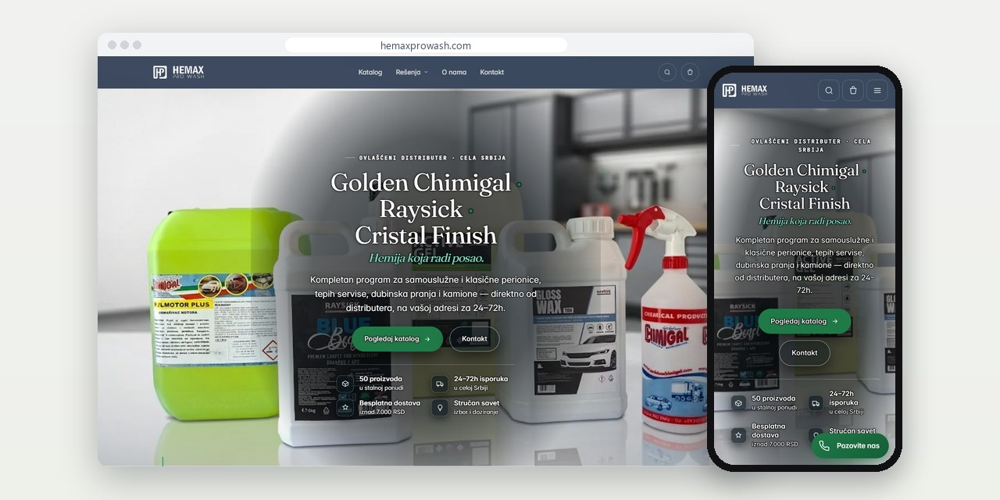
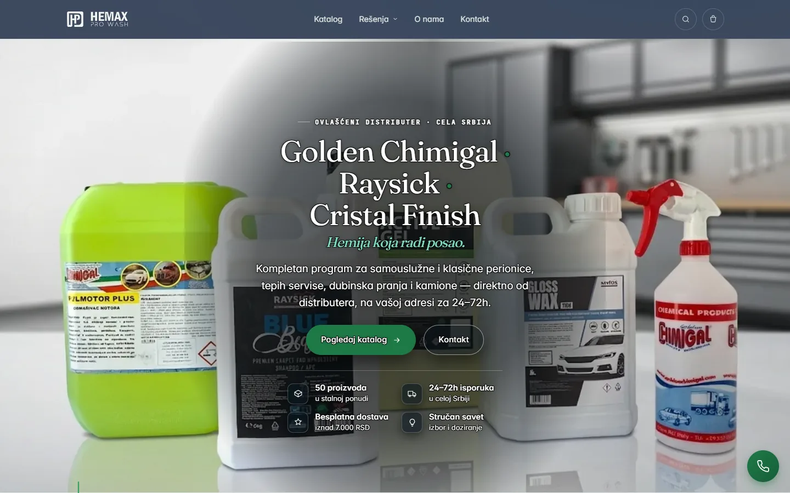
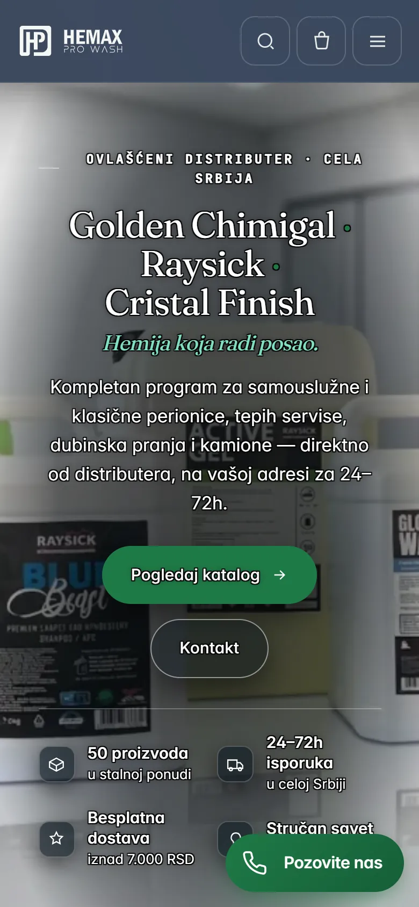
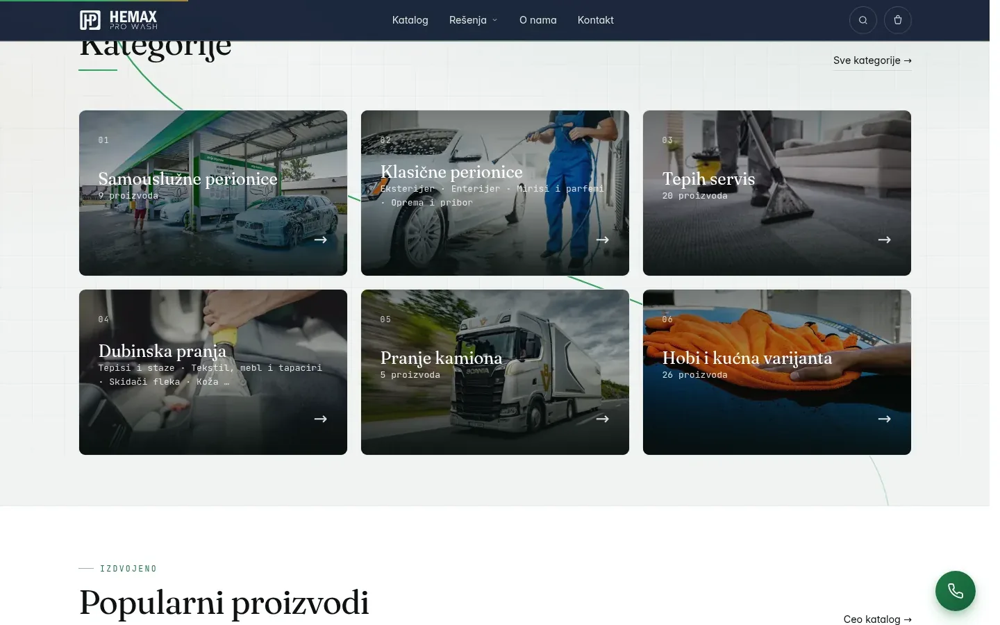
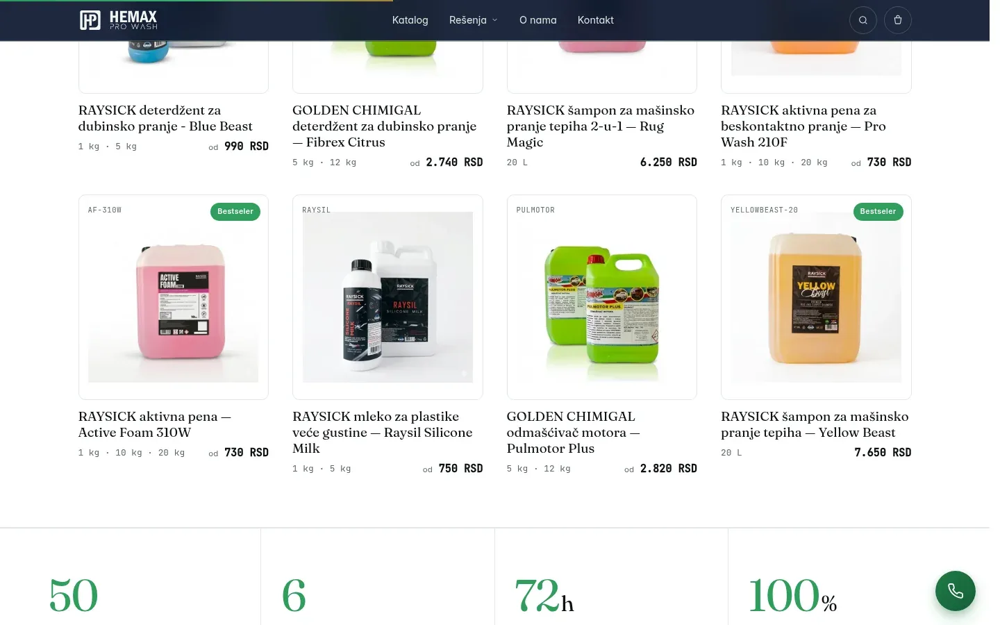

# Hemax Pro Wash

Web prodavnica za leskovačkog distributera profesionalne hemije, u kojoj je svako pakovanje varijanta sa svojom šifrom, cenom i stanjem.

**[hemaxprowash.com](https://hemaxprowash.com/)** · [Studija slučaja](https://svilenkovic.rs/radovi/hemax-pro-wash) · [English](README.md)

> [!NOTE]
> Klijentski projekat. Izvorni kod pripada klijentu i čuva se u privatnom repozitorijumu. Ova stranica opisuje šta sam uradio i kako.

<table>
  <tr><td><b>Klijent</b></td><td>Hemax Pro Wash</td></tr>
  <tr><td><b>Delatnost</b></td><td>Profesionalna hemija za perionice, tepih servise i pranje kamiona</td></tr>
  <tr><td><b>Lokacija</b></td><td>Leskovac</td></tr>
  <tr><td><b>Vrsta</b></td><td>Web prodavnica</td></tr>
  <tr><td><b>Moj deo posla</b></td><td>Dizajn, izrada, SEO, hosting i održavanje</td></tr>
  <tr><td><b>Tehnologije</b></td><td>PHP 8.3, SQLite, Vanilla JS, WebP/srcset, PWA</td></tr>
</table>

## O projektu

Hemax Pro Wash snabdeva samouslužne i klasične perionice, tepih servise i firme koje peru kamione profesionalnom hemijom i priborom, a robu iz Leskovca šalje u celoj Srbiji. Isti proizvod obično dolazi u više pakovanja, od flašice do kanistera od 25 kg, a cene se menjaju prečesto da bi svaka izmena išla kroz kod. Vlasnik je hteo da se poručuje bez naloga i da cene menja sam.

Pakovanja su varijante jednog proizvoda, svaka sa svojom oznakom, šifrom, cenom, stanjem i šifrom za fiskalnu kasu. Kartica u katalogu zato pokazuje cenu „od“, a na strani proizvoda cena se menja kad kupac izabere veličinu. Kad nestane jedne veličine, gasi se samo ona: prikazuje se precrtano, podrazumevana postaje prva dostupna, a korpa je odbija i kad neko pokuša da je doda zaobilazno.

## Šta sam uradio

- Porudžbina u jednom koraku bez registracije, pouzećem ili uplatom na račun, a iznos, dostavu i prag za besplatnu dostavu server ponovo računa
- Proizvod u više kategorija odjednom, sa dva redosleda koja se prevlače mišem: jednim za ceo katalog i jednim unutar svake kategorije
- A4 račun iz panela, sa šiframa iz kase zamrznutim u trenutku kupovine i iznosom ispisanim slovima
- Originalne fotografije ostaju netaknute kako je klijent tražio, a WebP kopije od 320, 640 i 960 px idu kroz srcset; fotografija od 829 KB u kartici se učitava kao 9 KB
- Statistika poseta u panelu bez kolačića, sa otiskom posetioca koji se menja svakog dana, i večernji mejl sa porudžbinama, prometom, upitima i posetama
- Brojač pregleda koji čeka na zaključavanje SQLite baze i ne može da obori stranu; dvanaest paralelnih zahteva ranije je davalo pet grešaka, sada nijednu

## Merenja

| | Performanse | Pristupačnost | Dobre prakse | SEO |
| :-- | :-: | :-: | :-: | :-: |
| Telefon | 97 | 100 | 100 | 100 |
| Desktop | 100 | 100 | 100 | 100 |

PageSpeed Insights, laboratorijsko merenje živog sajta, septembar 2026. Sigurnosna zaglavlja: 6 od 6. HTML validator: bez grešaka. axe provera pristupačnosti: bez prekršaja. Strukturisani podaci: `FAQPage`, `OnlineStore`, `Organization`, `Store`.

## Snimci ekrana

<table>
  <tr>
    <td width="68%" valign="top"></td>
    <td width="32%" valign="top"></td>
  </tr>
</table>

Kategorije i popularni proizvodi na naslovnoj

Naslovna strana, dalje nadole

---

Izrada: [D. Svilenković](https://svilenkovic.rs).
